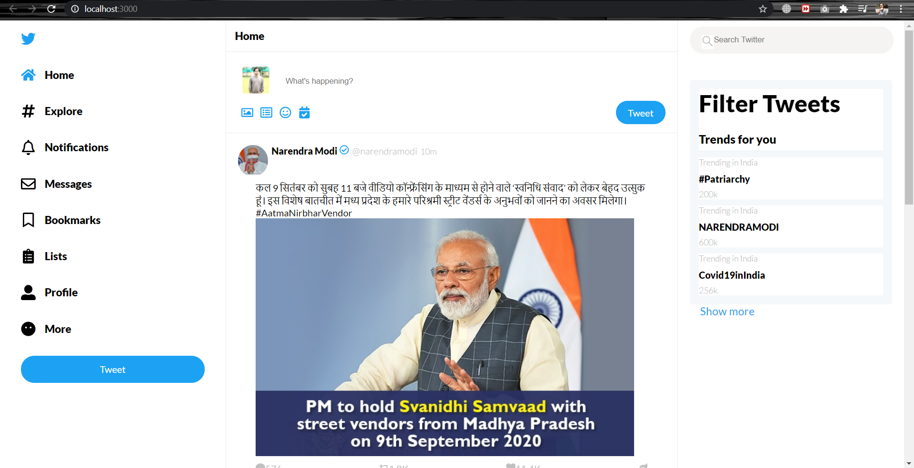

This is a react application which displays twitter like page .

The application is made up using create-react-app and other packages of react library.
CSS are used to style up the page.

The application contains various components which together make the whole application ,such as:
Filters Component,
SideBar Component,
Trends Component ,
Posts Component,
Trends Keywords Component, etc

All the css for the application is in App.css file.
The application can be started up running command "npm start" in the root folder .
Running this command twitter-react application will be served up by "localhost:3000" server.

Various functionalities that app consists of are :
 User being able to see most recent tweets posted by them and the people they follow.
 Filtering tweets by searching that is based upon text-based or no. of characters based.
 Users would be able to see trending tweets and can follow them .
 User would have option to post the tweets .
 Many other icons are available at side bar.

